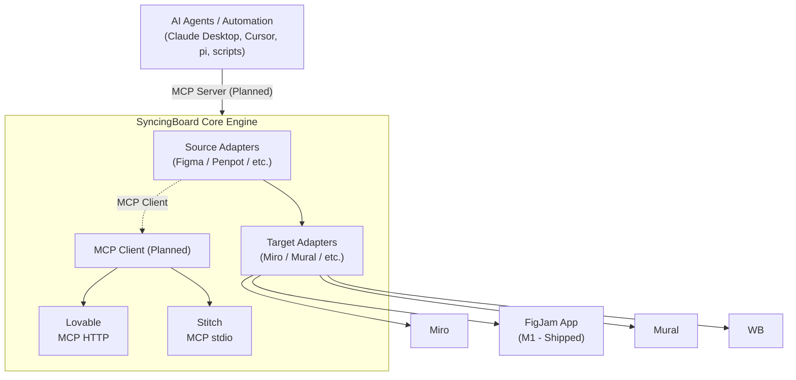

# SyncingBoard Architecture & System Design

SyncingBoard is a stateless design-to-canvas sync engine designed to fetch, render, and update screenshots in-place on whiteboards. It supports **Figma** and **Penpot** as design sources, **Miro** as the primary canvas target, a shipped **FigJam app** target (M1), and further platforms under research.

### Why Stateless?

SyncingBoard is deliberately built as a stateless proxy engine for key technical, security, and operational reasons:

* **Privacy-First Security Model:** We never store raw Figma or Miro access tokens, credentials, or design screens on our servers. Rate limiting identifies callers using anonymous, one-way SHA-256 token fingerprints (`tok:sha256(token)`) from which original access tokens can never be recovered. Your intellectual property remains strictly within your design tools.
* **Third-Party Cookie Resilience:** Miro plugins operate inside sandboxed browser iframes where modern browsers block third-party cookies. Storing tokens client-side within the active Miro session avoids iframe cookie restrictions entirely.
* **Enterprise Compliance Exemption:** Storing zero personal data or design files bypasses GDPR Data Subject Access Requests (DSARs), right-to-be-forgotten pipelines, and complex Data Processing Agreements (DPAs) for enterprise security reviews.
* **Zero Infrastructure Overhead:** Operating database-free allows self-hosters and design teams to deploy SyncingBoard in minutes on serverless hosts (like Vercel) with zero database management or storage costs.
* **Self-Healing Serverless Scale:** Serverless functions scale instantly from 0 to 10,000 requests/minute and back to 0 without database schema migrations, connection pool limits, or cold-start latency.
* **Seamless Board Collaboration:** Frame pairing metadata is stored directly inside Miro widget properties (`title`). This enables any teammate on the board to sync design updates without requiring complex multi-user database permissions.

### Architectural Trade-Offs

While statelessness delivers maximum privacy and zero infrastructure overhead, it involves deliberate technical trade-offs:

* **Client-Scoped Sessions:** OAuth tokens live in client-side Miro board metadata; clearing browser data or moving to an un-paired browser requires re-authenticating.
* **Payload Constraints:** Without server-side cloud storage (S3), image transfers travel directly via serverless HTTP response bodies and are subject to host payload limits (4.5MB on Vercel).
* **No Historical Sync Activity:** SyncingBoard retains no historical user activity logs, past sync dashboards, or permanent audit histories.

---

## Quick Status & Module Directory

| Module | Status | Availability | What it covers |
|---|---|---|---|
| **[1. Source Adapters](./architecture/sources.md)** | stable / draft | **Figma & Penpot (LIVE)**; Lovable, Stitch, UXPin, Framer, Adobe UXP *(Planned)* | Cloud REST & Penpot event-driven WASM relay; future source specs. |
| **[2. Target Adapters & Metadata](./architecture/targets.md)** | stable / design | **Miro (LIVE)**; Mural, MS Whiteboard *(Planned)* | Miro SDK v2, REST PATCH, stateless metadata signatures (`[FigmaSync|...]`, `[PenpotSync|...]`), `preserveSize`, `replaceSelectedWidget`. |
| **[3. Selection Detection & Relay](./architecture/selection-and-relay.md)** | stable | **LIVE** | Real-time Ably WebSocket selection stream, zero-Redis selection payloads, `companionRelayClient.ts`, secure pairing IDs. |
| **[4. Security & Rate Limits](./architecture/security-and-limits.md)** | stable | **LIVE** | Sliding window rate limiting (`@upstash/ratelimit`), token hashing (`tok:sha256(token)`), Redis `SETEX` 300s OAuth store. |
| **[5. Testing & Quality Assurance](./architecture/testing.md)** | stable | **LIVE** | 132 automated Vitest tests across 18 files, zero-network mocking strategy, and CI pipeline setup. |
| **[6. Data Transport & Infrastructure Costs](./architecture/infrastructure-and-costs.md)** | stable | **LIVE** | Vercel 4.5MB limits, byte travel, self-host cost matrix, zero cloud rendering costs, Tauri payload extender. |
| **[7. MCP Transport Roadmap](./architecture/mcp-roadmap.md)** | design | **PLANNED** | Speculative MCP client & server specifications for AI agents. |
| **[8. Historical Archives](./architecture/archive/chromium-loopback.md)** | historical | Archived | [Chromium Loopback & Sandboxing](./architecture/archive/chromium-loopback.md) and [Architecture Evolution Log](./architecture/archive/architecture-evolution.md). |

---

## Architectural Principle: Adapter Layers

SyncingBoard is organized into three adapter layers, each interchangeable:

Each adapter implements a uniform interface. Adding a new source means writing a new source adapter; adding a new target means writing a new target adapter. The transport and security layers are shared across all components.
