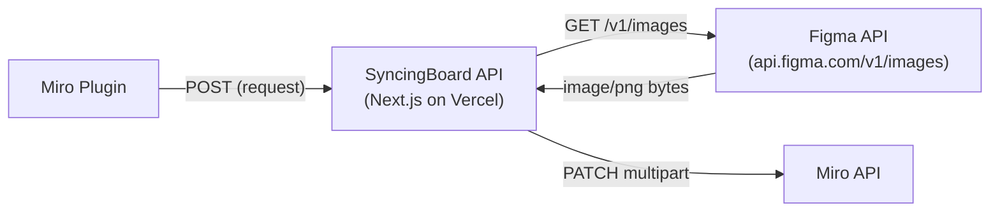
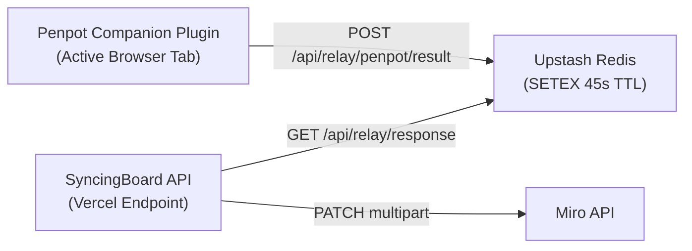

# Data Transport & Infrastructure Costs Architecture

> **Status:** stable — current cost model and payload transport pathways.

Understanding where image bytes travel is critical for evaluating hosting costs, serverless ceilings, and scaling strategies.

---

## Data Path Traces & Byte Flows

### Figma Sync Path (Cloud-Native)

* **Byte Travel:** Image bytes pass through Vercel twice (download from Figma, upload to Miro). Counts against Vercel function execution time (max 60s Pro) and outbound bandwidth.

### Penpot Relay Path (Cloud-Relay)

* **Byte Travel:** Penpot companion renders PNG/SVG in active browser tab ➔ posts to Redis ➔ Miro plugin reads/deletes from Redis ➔ posts to Miro API.

---

### Cross-Machine & Multi-Consumer Relay (Design Property)

The relay is **machine-agnostic by design** — the pairing ID (`sb_xxxx`) is the cross-machine session key, and nothing in the protocol is bound to a machine or origin.

- **Cross-machine import/sync works today:** companion open on machine A (Figma/Penpot, pairing `sb_abc`) ⇄ any Miro board on any other machine (same pairing). The companion relays to the server channel; the destination pulls (push/pull model).
  - Figma: the companion only returns selection *metadata* inline; the actual render is server-side via the Figma REST API (`/api/figma/render-batch`) — zero image bytes cross the relay.
  - Penpot: the companion renders in-browser; the payload transits Upstash Redis (`/api/relay/penpot/result` SETEX 180s) — the Redis buffer is exactly what makes cross-machine Penpot work.
- **Penpot = "pseudo cloud API":** with one open Penpot project (companion connected), any number of Miro boards sharing the pairing can detect/import/sync against it, from any machine. Each request carries a unique `requestId`; the companion replies with the matching one and each board filters by its own — concurrent multi-consumer operation works today.
- **Caveats (shape future "teams" plans):**
  - The companion is a single-threaded renderer — concurrent exports queue behind it.
  - Rate budgets are **per-pairing, not per-consumer** (`relay:request` 5/min, `relay:export` 2/min & 20/day) — N designers on one pairing share one budget; teams plans would need per-consumer budgets.
  - The pairing ID is the shared secret — anyone holding it can trigger read-only select/export against the open project (broadcast trust).
  - Tauri is the only same-machine-scoped piece (desktop byte transport); the default cloud path is cross-machine by nature.

---

## Size Constraints & Serverless Ceilings

## Size Constraints & Serverless Ceilings

| Constraint / Limit | Affected Path | Architectural Mitigation |
|---|---|---|
| **Vercel Serverless Body Limit (4.5MB)** | Image upload to `/api/miro/update-image` | Compress images before upload; offer SVG format; optional Tauri chunk streaming. |
| **Vercel Execution Timeout (10s Hobby / 60s Pro)** | Large batch renders | Batch limit of 3 unique images; 500ms Miro update throttle; Retry-After backoff (capped at 10s). |
| **Upstash Redis Value Limit (256MB Data Size)** | Penpot base64 exports | Ephemeral 180s TTL auto-deletion (`SETEX 180`); max payload capped by Vercel 4.5MB response limit. |
| **Upstash Redis Monthly Command Pool (500,000 Cmds)** | Rate-limiting & Penpot relay | Slowed OAuth polling (4s interval); scoped backstops (auxiliary endpoints excluded from global counter). |
| **Ably Realtime Connection Limit (200 WebSockets)** | Selection relay & Penpot status | Redis Lua `ZSET` session lease (`acquireRelaySession`) capping active Miro relay clients at **40 concurrent leases** (one WebSocket per relay client (channels multiplex)) with a **1-board-per-user binding** (`relay:user_board:{userIdHash}`, 30-min TTL) + one-click session transfer (v0.15.1). v0.15.2 adds a **companion cap 180 / Miro 20-socket floor** (`RATE_LIMIT_COMMUNITY_MAX_COMPANION_TOKENS`, default 180; set `0` for unlimited): companion tokens are TTL-tracked in `relay:active_companion_tokens`, orphans (no live Miro lease — `relay:miro_pairing` mirror) are evicted oldest-first so active pairs always win, and **1 tab per pairing** (`relay:companion_session:{pairingId}`) with a transfer UX stops duplicate companion tabs from squatting sockets. |
| **Vercel Outbound Bandwidth (100GB Hobby / 1TB Pro)** | Image downloads & uploads | SVG vector preference (~10x smaller than PNG). |

---

## Free-Tier Capacity & Quota Safety Proof

Under a **500 global daily sync cap** (500 syncs/day = 15,000 syncs/month), **monthly quota exhaustion is mathematically impossible** across all free-tier providers:

1. **Ably Realtime (6,000,000 Messages / Month Pool):**
   - Max usage at 500 syncs/day: 500 syncs/day * 4 msgs/sync * 30 days = **60,000 msgs/month**.
   - **Result:** Uses **1% of Ably's monthly free allowance**.
2. **Upstash Redis (500,000 Commands / Month Pool & 10 GB Bandwidth):**
   - Max usage at 500 syncs/day (3,000 cmds/day) + OAuth polling (~1,500 cmds/day):
     (3,000 + 1,500) cmds/day * 30 days = **135,000 cmds/month**
   - **Result:** Uses **27% of Upstash's monthly free allowance**.
3. **Vercel Serverless (100,000 Invocations & 100 GB Bandwidth / Month):**
   - Max invocations: 500 * 3 execs * 30 = **45,000 invocations/month** (**45% of Vercel limit**).
   - Max bandwidth: 500 * 0.5 MB * 30 = **7.5 GB/month** (**7.5% of Vercel limit**).

---

## v0.15.2 Infra Rebalancing (R1–R5)

The 0.15.2 release rebalances the *actual* consumers (companions are the persistent Ably consumers; Miro sidebars are transient + 30s idle close):

- **R1 — status polling:** the blind 30s `/api/relay/status` poll (the #1 Redis + Vercel consumer: ~4-6 Redis cmds + 1 invocation per poll, ~120 polls/hour per idle Import tab) is gone. Polling now happens on connection-state transitions, after relay ops, and on demand; a 10-min drift guard remains. The status route dedupes concurrent recomputes under a 10s `SET NX EX` cache key.
- **R2 — Penpot SVG inline:** SVG exports with compact JSON (< 12KB) stream inline over Ably (`result` message) instead of the HTTP + Redis path (~10 Redis cmds + 4 invocations → ~2 Ably messages + 0 Redis + 0 extra invocations). PNG/base64 and large payloads keep the Redis path.
- **R3 — Lua-batched rate limits:** multi-window endpoints batch all windows in a single Redis EVAL (`checkMany`, 1 command instead of N) with a per-window fallback.
- **R4 — async-only relay:** the dead 350ms sync-poll loop (23-46 Redis GETs per op) was removed from `/api/relay/request`; non-async callers get a 400.
- **R5 — client token cache:** the Miro plugin caches the 2h Ably token per session (invalidated on conflict/eviction), so token traffic mostly disappears during active sessions.

---

## Hosting & Self-Hosting Cost Matrix

| Hosting Tier | Vercel Plan | Upstash Plan | Ably Plan | Monthly Cost | Capacity |
|---|---|---|---|---|---|
| **Community Free** | Hobby (Free) | Free (500k cmd/mo) | Free (200 conns/6M msgs) | **$0 / mo** | 40 active sessions (1 board per user); 500 syncs/day; under 4.5MB per image. |
| **Team Figma Sync** | Pro ($20/mo) | Free (500k cmd/mo) | Free (200 conns/6M msgs) | **~$20 / mo** | 1TB bandwidth, 60s execution timeout, 1M invocations. |
| **Heavy Penpot Sync** | Pro ($20/mo) | Pay-as-you-go ($0.20/100k cmds) | Standard ($29/mo) | **~$50–$55 / mo** | High-concurrency relay messages & Redis single-read buffers. |
| **Enterprise / Private** | Corporate AWS/GCP Docker | Managed Redis | Optional | **$0 extra** | Runs on existing corporate container infra; zero per-request limits. |

---

## Cost-Efficient Architectural Principles

1. **No Persistent Servers:** Runs on serverless Vercel endpoints and serverless Upstash Redis.
2. **Zero Cloud Rendering Costs:** Shape rendering runs locally on the designer's GPU/CPU inside the Penpot browser tab — **$0 cloud compute cost**.
3. **Zero Persistent Blob Storage:** Images flow through Vercel/Redis ephemerally into Miro — no S3 buckets or CDN storage required.
4. **SVG-First Strategy:** Prefers vector SVG for Penpot exports, reducing bandwidth by 10x compared to high-resolution PNGs. *(Miro target. The FigJam app is PNG-only — SVG is rasterized client-side before placement.)*

---

## How Tauri Reduces Infrastructure Costs

When the optional Tauri desktop app is active:
* **Direct Multipart Uploads:** Tauri streams multi-megabyte image chunks directly to Miro API, completely bypassing Vercel's 4.5MB serverless body limit and saving Vercel outbound bandwidth.
