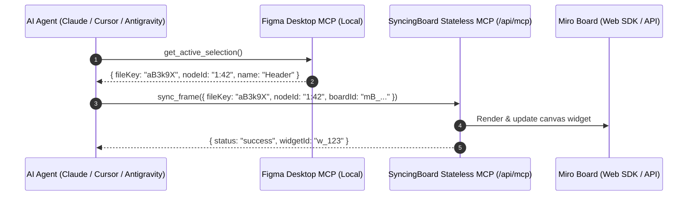
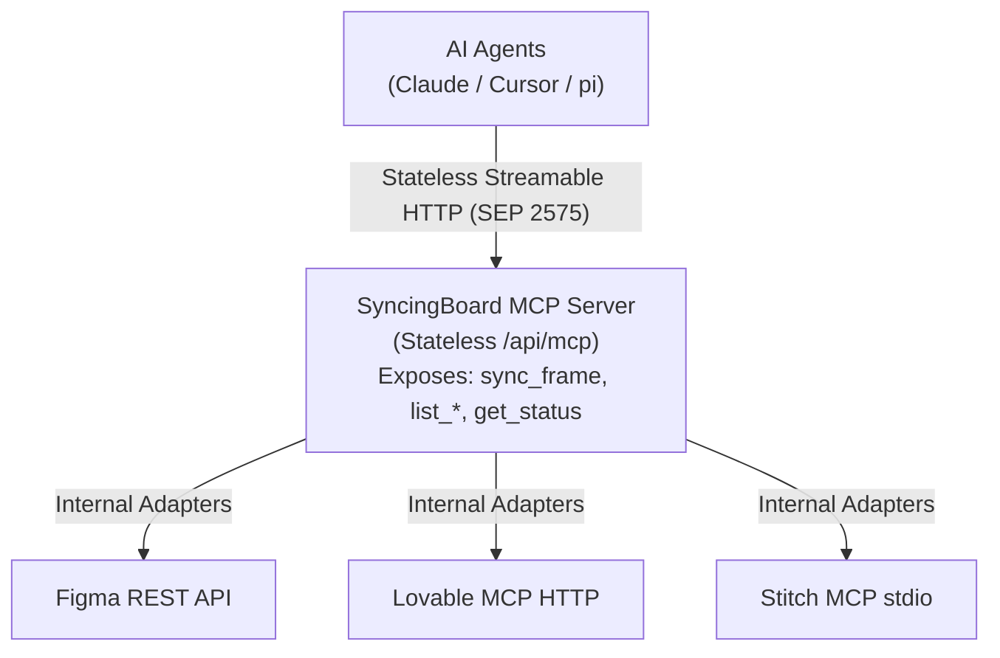

# Model Context Protocol (MCP) Roadmap Architecture

> **PLANNED FEATURE / FUTURE ROADMAP SPECIFICATION**
> **Overview:** SyncingBoard's proposed Model Context Protocol (MCP) layer defines future capabilities for acting as an **MCP client** to consume design-source MCP servers (Lovable, Stitch) and as an **MCP server** to expose SyncingBoard tools to AI agents. *Note: Neither the MCP client nor the MCP server are implemented in the v0.13.3 production build.*

---

## SyncingBoard as MCP Client (Planned)

> **Status:** draft / planned — transport design verified with `@modelcontextprotocol/sdk` v1.29.0+ (*not installed in v0.13.3 package.json*).

SyncingBoard can act as a **remote MCP client** using the official `@modelcontextprotocol/sdk` (v1.29.0+). This enables SyncingBoard (running on Vercel serverless) to call MCP servers over HTTP like any REST API — no subprocess management required for remote MCP endpoints.

### Supported MCP Transports
| Transport | SDK Transport Class | Used For | Serverless Compatible? |
|---|---|---|---|
| **Streamable HTTP** | `StreamableHttpClientTransport` | Lovable MCP (`mcp.lovable.dev`) | Plain `fetch()` |
| **stdio** | `StdioClientTransport` | Stitch MCP (`stitch-mcp`) | Requires hosted subprocess manager |
| **SSE** | `SseClientTransport` | Future MCP servers | Long-lived connection |
| **WebSocket** | `WebSocketClientTransport` | Future real-time MCP servers | Connection management required |

### Lovable MCP Integration Pattern
HTTP-based MCP integration uses standard JSON-RPC calls over HTTPS:

```typescript
import { Client } from "@modelcontextprotocol/sdk/client/index.js";
import { StreamableHttpClientTransport } from "@modelcontextprotocol/sdk/client/streamableHttp.js";

async function callLovableTool(accessToken: string, tool: string, args: object) {
  const transport = new StreamableHttpClientTransport({
    url: new URL("https://mcp.lovable.dev"),
    auth: { bearerToken: accessToken },
  });

  const client = new Client(
    { name: "syncingboard", version: "1.0.0" },
    { capabilities: {} }
  );

  await client.connect(transport);
  return client.callTool({ name: tool, arguments: args });
}
```

---

## SyncingBoard as MCP Server (Planned)

> **NOT AVAILABLE YET (PLANNED FEATURE / FUTURE ROADMAP SPECIFICATION)**

SyncingBoard can act as an **MCP server** — exposing its own tools to AI agents (Claude Desktop, Cursor, pi, custom scripts).

### Stateless MCP Architecture (SEP 2575 & Cloudflare/Google Alignment)

> **Specification Standard:** SEP 2575 (Stateless MCP)
> **Target Endpoint:** `src/app/api/mcp/route.ts` (Next.js App Router Serverless Route)

SyncingBoard's MCP Server implementation adheres to **Stateless MCP (SEP 2575)**. Instead of maintaining long-lived SSE connections or transport-level session memory, SyncingBoard handles MCP requests as self-contained, stateless HTTP calls over **Streamable HTTP**.

#### Architectural Key Points
1. **Serverless-Native (Vercel)**: Implemented as a single serverless API route (`/api/mcp`) on Next.js App Router without requiring dedicated VMs or persistent container sockets.
2. **Scale to Zero**: Zero idle compute cost; executes on-demand when invoked by AI agents.
3. **Application-Layer State**: Domain state (e.g. `pairingId`, `boardId`, OAuth tokens) is passed within explicit request payloads or headers, backed by ephemeral Upstash Redis caching (180s–300s TTL).

### Multi-MCP Chaining Architecture

AI Agents (Claude Desktop, Cursor, Antigravity) act as the universal orchestrator between local design MCPs (Figma Desktop MCP, Penpot MCP) and SyncingBoard's cloud serverless MCP API:



### Exposed Tools
| Tool | Description | Example Agent Prompt |
|---|---|---|
| **`sync_frame`** | Fetch latest from source (Figma/Stitch/Lovable) and push to Miro widget | "Sync the login screen to the board" |
| **`list_widgets`** | List all synced widgets on a board with source metadata | "What's on the board right now?" |
| **`get_status`** | Check sync freshness of a specific widget | "Is the home screen up to date?" |
| **`batch_sync`** | Sync multiple frames in one call | "Sync all Figma frames to Miro" |
| **`list_projects`** | List connected source projects | "What designs are available?" |
| **`list_sources`** | Show design accounts linked to SyncingBoard | "Which Figma account is connected?" |

### Symmetric Architecture Diagram

